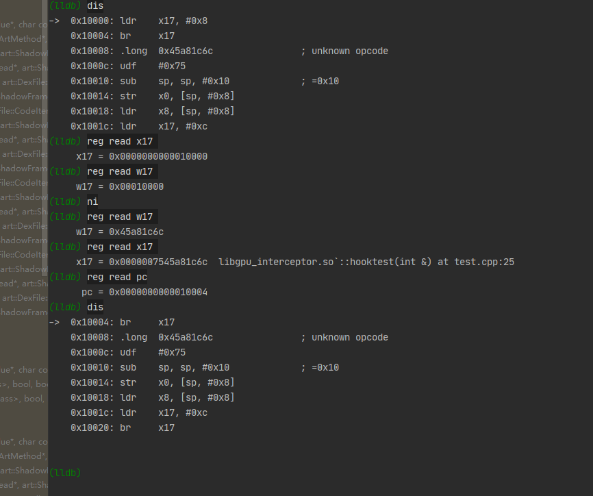
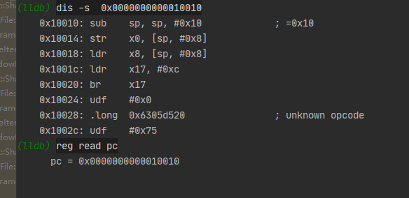

中间跳板生成之后：


此时仅生成了中间跳板函数，还未修改原函数

0x10000是中间跳板函数的地址，发现前两个地址已经被修改成了跳转到hook函数的地址，0x10010处的代码和原函数代码相同，证明源函数的入口已经变成了0x10010


修改过原函数之后:发现其前三个指令发生变化


程序执行到此处时执行，发现x17的值已经改变。

在执行 ldr    w17, 0x756305d51c之后x17和w17均变为0x10000也就是中间跳板的地址。


继续执行，此时pc指针会跳到中间跳板的位置



在执行到0x10004的时候pc,x17已经指向了hook函数的地址。

继续执行则会进入hook函数中。

还记得之前提到说新的函数入口变为了0x10010吗？当我们使用如下方法将malloc出来的堆内存变为可执行函数之后，就可以引导PC指针跳到原始的函数中

```c++
void *callback = NULL;
typedef int (*p) (int &a) ;
p realfunc;
extern "C" {
    ./**
    *hook函数
    *./
void hooktest(int &a) {
    a = a + 1000;
   realfunc =reinterpret_cast<p>(callback);
   realfunc(a);././调用callback所对应的函数
}
void hookfunc(){
    void *interceptor = InitializeInterceptor();

    void *fp = dlopen("libtestlib.so", RTLD_NOW);
   
    void *func = dlsym(fp, "testfunc");

    InterceptFunction(interceptor, func, (void *) hooktest, &callback, &intercept_error, nullptr);././开始hook，并将新的函数地址赋给callback
    int t = 1;
    testfunc(t);
}
}
```

```c++
././原函数
    #include "testlib.h"
extern "C" {
__attribute__((visibility("default"))) int testfunc(int &a) {
    a = +1;././a直接赋1
    return 0;

}
}

```


即将要跳转的地址x8就是新的函数地址。


继续运行，并查看pc寄存器就能发现此时已经进入了callback函数中



我们让其进入原函数并查看


此时的a传入进来的时1001,也就是hook函数修改的值，然后执行完成原函数之后，a变为1


然后整个流程结束。